## School-Management-System
School Management system in Python using tkinter library for GUI and sqlite3 for database management.

<!-- ABOUT THE PROJECT -->
## 📝About The Project
The project is for a School Management System build using Python. The GUI is made using tkinter library and sqlite3 is used for database management system. The user has to login using his/her username and password. There are options for logging in for student, teacher or principal. When a student logs in using his/her correct username and password, the student can see his/her details. The teacher can login and see his/her details. The teacher can also add a new student's information and also edit an existing student's information. The principal can see his/her information, edit his/her personal information, add a new teacher's information or edit a teacher's information.

<!-- HOW TO USE -->
## Setting Up the Development Environment
### Requirements

- [Python](https://www.python.org)

#### Getting the requirements

1. Download and install **Python**

   Download and install Python from [here](https://www.python.org/downloads/ "Go to official Python download page.").
   
2. Install the tkinter library library. The sqlite3 library is installed by default when you install python.
   
   ```shell
   pip install tk
   ```
### Configuring the project for development

1. Clone this repository

   ```shell
   git clone https://github.com/rushgala27/School-Management-System.git
   cd School-Management-System
   ```
   
### Sample Login Credentials
1. **Student Login:** <br>
   Username - Rushabh123 <br>
   Password - 12345678 <br>

2. **Teacher Login:** <br>
   Username - Darshi999 <br>
   Password - darshik@26 <br>

3. **Principal Login:** <br>
   Username - RajanUp12 <br>
   Password - RUpadhyay123 <br>

<!-- SCREENSHOTS -->
## 📱Screenshots
<br>
<table>
  <tr>
    <td><b> Login Page </b></td>
  </tr>
  <tr>
    <td>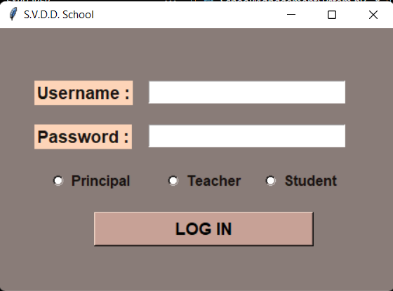</td>
  </tr>
 </table>
 <br>

<table>
  <tr>
    <td><b> Student Login </b></td>
     <td><b> Student Information </b></td>
  </tr>
  <tr>
    <td>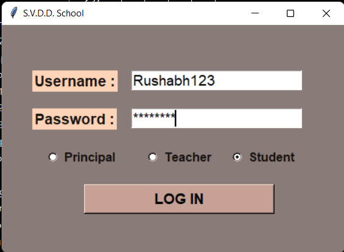</td>
    <td>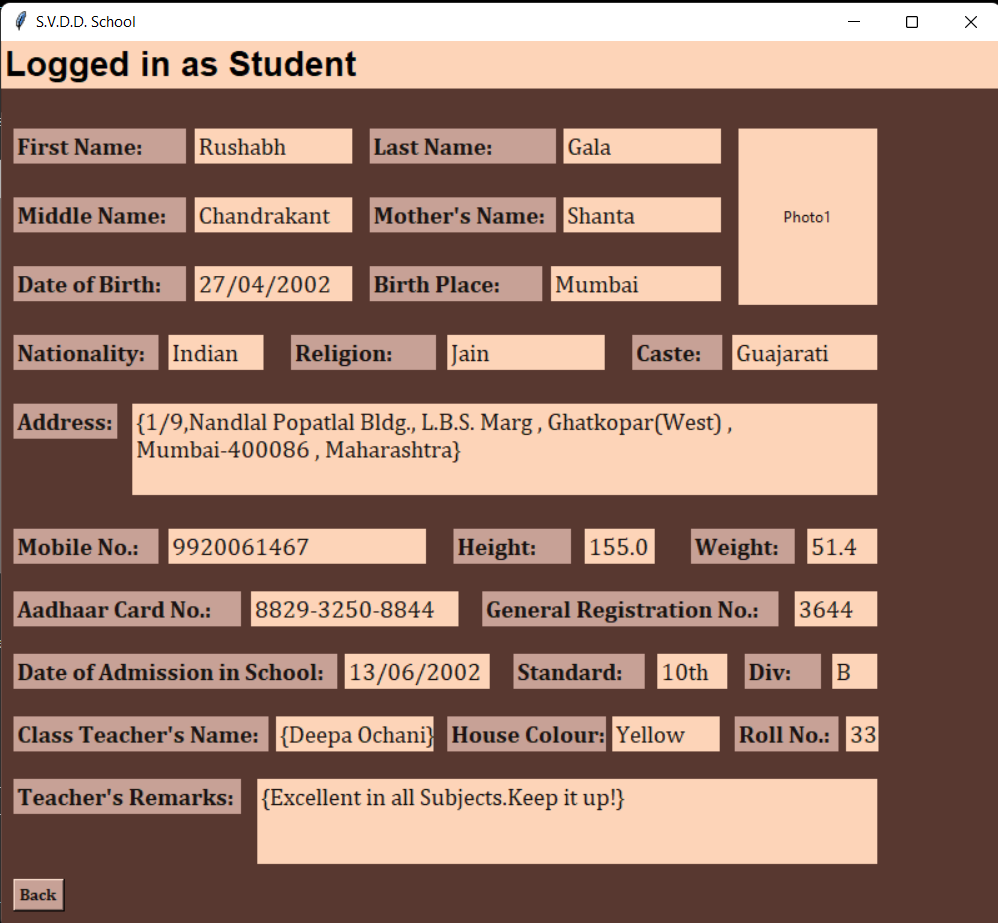</td>
  </tr>
 </table>
 <br>

<table>
  <tr>
     <td><b> Teacher Login </b></td>
     <td><b> Teacher Information </b></td>
  </tr>
  <tr>
    <td>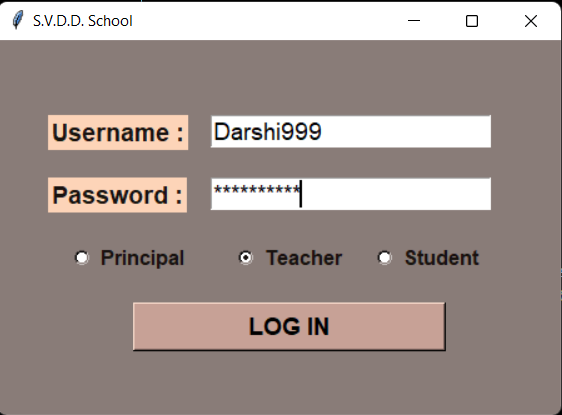</td>
    <td>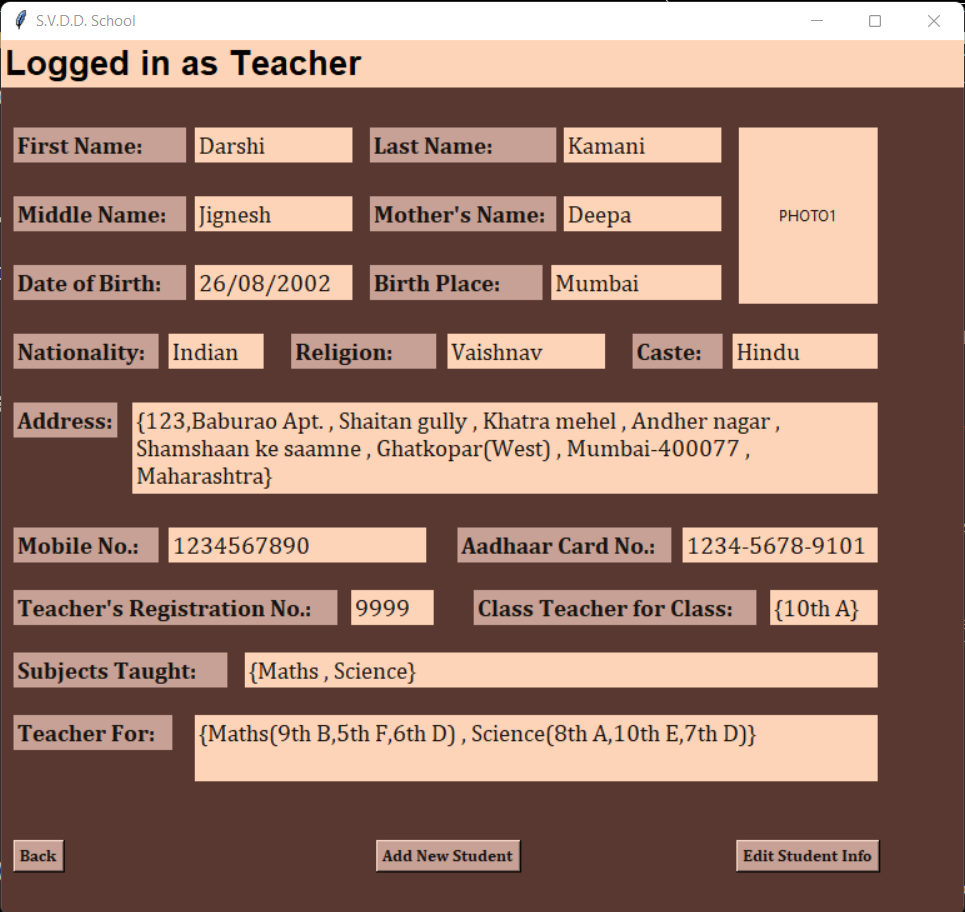</td>
  </tr>
 </table>
 <br>
 
 <table>
  <tr>
     <td><b> Add New Student </b></td>
     <td><b> Added Successfully </b></td>
  </tr>
  <tr>
    <td>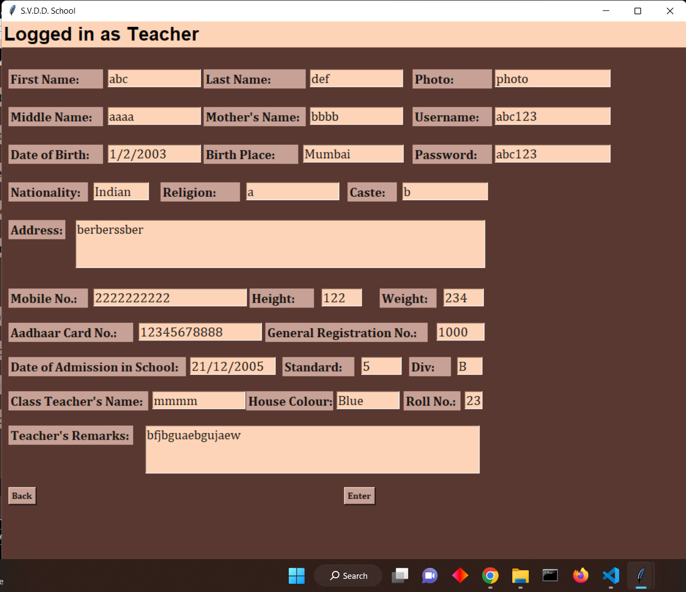</td>
    <td>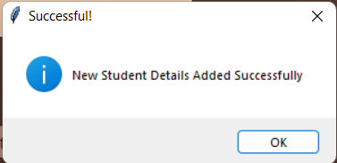</td>
  </tr>
 </table>
 <br>
 
<table>
  <tr>
     <td><b> Edit Student Info </b></td>
     <td><b> Edit Student Info </b></td>
  </tr>
  <tr>
    <td>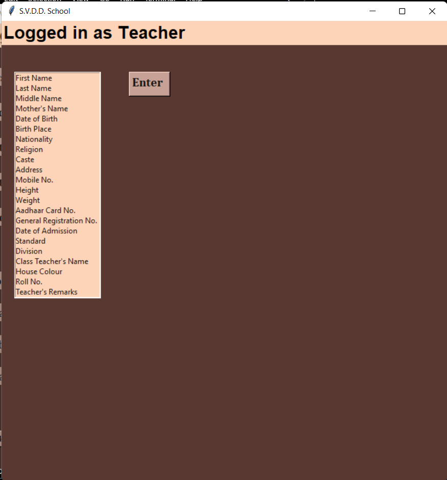</td>
    <td>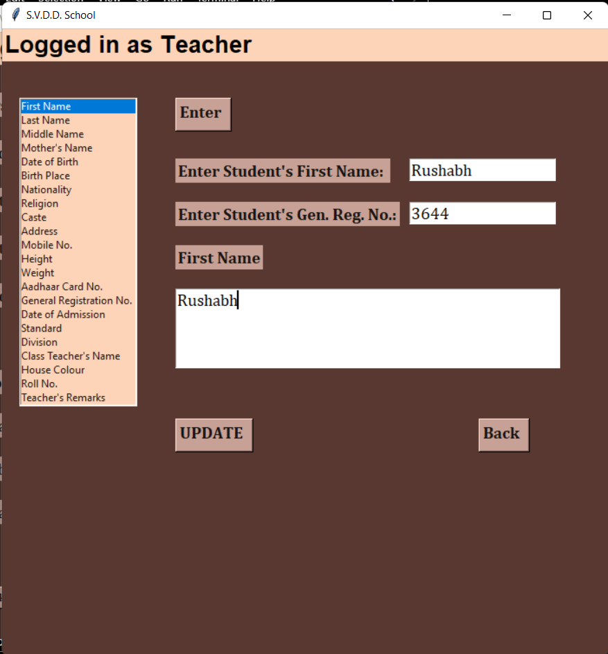</td>
  </tr>
 </table>
 <br> 
 
 <table>
  <tr>
     <td><b> Student Info Updated Successfully </b></td>
  </tr>
  <tr>
    <td></td>
  </tr>
 </table>
 <br>
 
 <table>
  <tr>
     <td><b> Principal Login </b></td>
     <td><b> Principal Information </b></td>
  </tr>
  <tr>
    <td>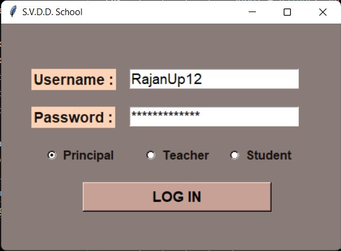</td>
    <td>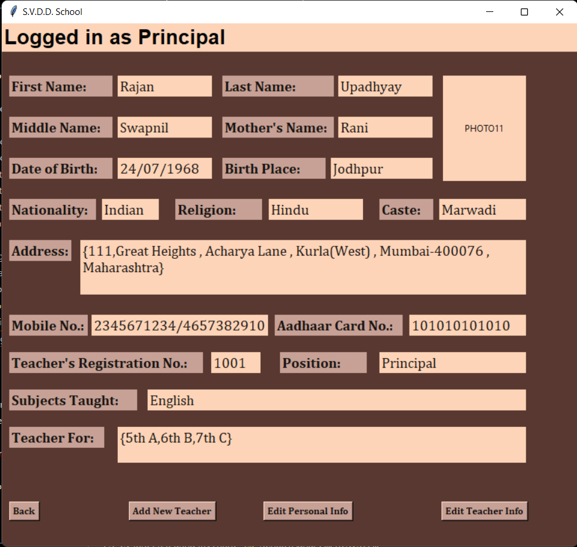</td>
  </tr>
 </table>
 <br>
 
 <table>
  <tr>
     <td><b> Edit Teacher Information </b></td>
     <td><b> Edit Personal Information </b></td>
  </tr>
  <tr>
    <td>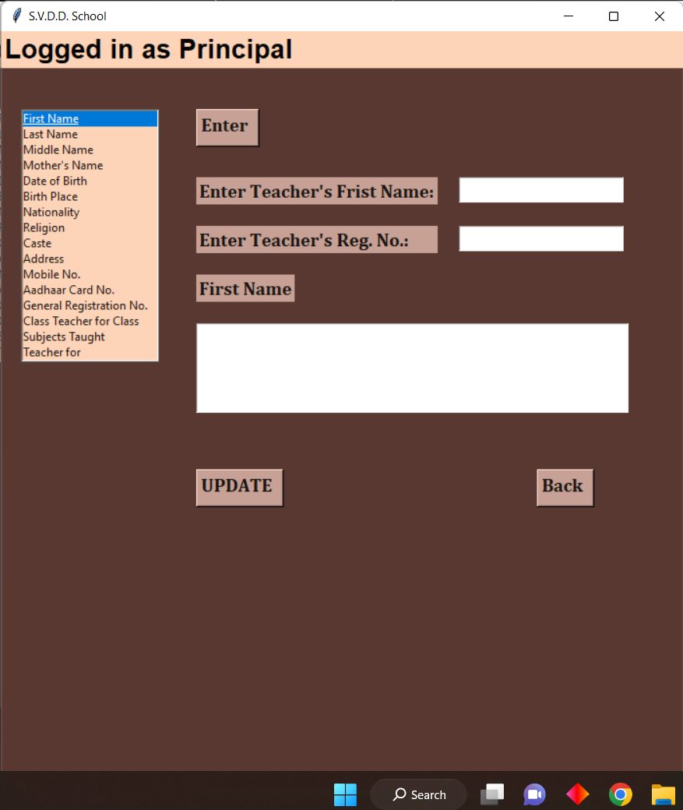</td>
    <td>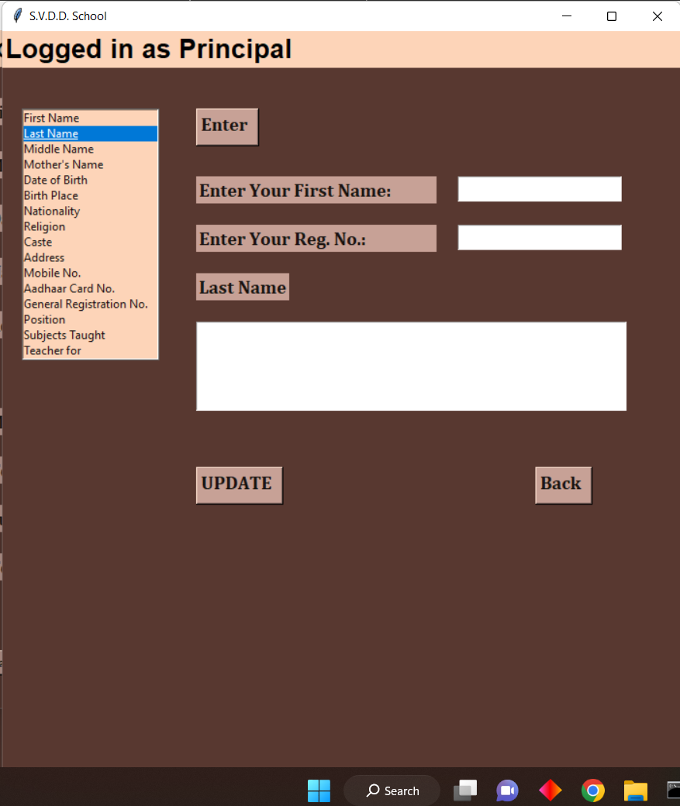</td>
  </tr>
 </table>
 <br>
 
 <table>
  <tr>
     <td><b> Add New Teacher </b></td>
     <td><b> Incorrect Password </b></td>
  </tr>
  <tr>
    <td>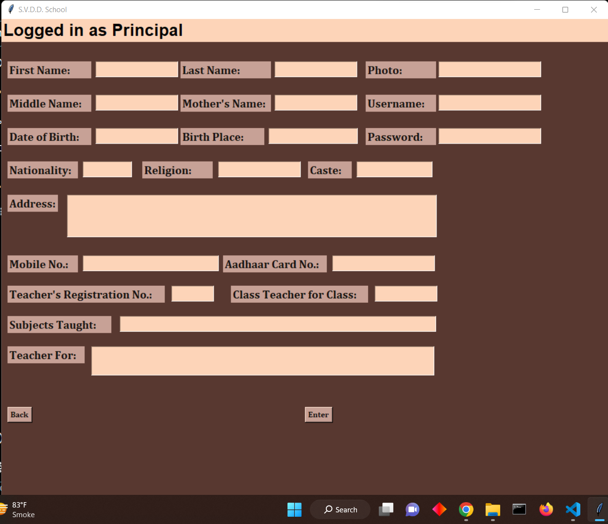</td>
    <td>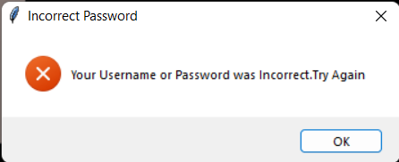</td>
  </tr>
 </table>
 <br>

<!-- TECH STACK -->
## 🤖Tech Stack
 **Python**

<!-- CONTRIBUTING -->
## 🔮Contributing

Contributions are what make the open source community such an amazing place to learn, inspire, and create. Any contributions you make are greatly appreciated.

If you have a suggestion that would make this better, please fork the repo and create a pull request. You can also simply open an issue with the tag "enhancement". Don't forget to give the project a star! Thanks again!

1. Fork the Project
2. Create your Feature Branch (`git checkout -b feature/AmazingFeature`)
3. Commit your Changes (`git commit -m 'Add some AmazingFeature'`)
4. Push to the Branch (`git push origin feature/AmazingFeature`)
5. Open a Pull Request


<!-- LICENSE -->
## 🖼License


Distributed under the MIT License. See `LICENSE` for more information.


  <p>
    <a href="https://github.com/rushgala27/School-Management-System/issues">Report Bug</a>
    <br>
    <a href="https://github.com/rushgala27/School-Management-System/issues">Request Feature</a>
  </p>
